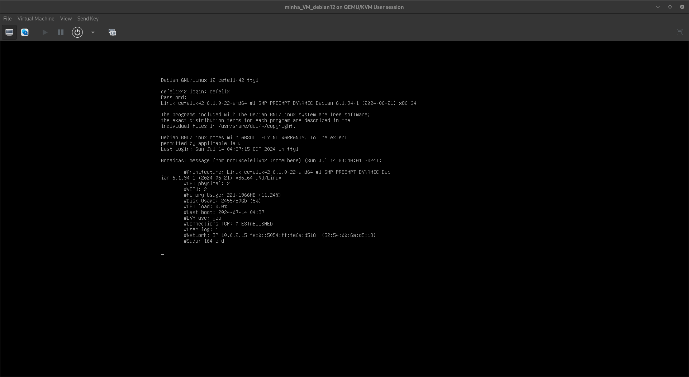

# Monitoramento de Sistema

Este repositório contém um script Bash para monitorar o estado de um sistema Linux. O script coleta várias informações sobre o sistema, como o uso de CPU, memória, disco, conexões de rede e muito mais. Afim de automatizar o processo fiz uso do utilitário "cron" (crontab), afim de executar o script em cada 10min.

## Conteúdo

- `monitoring.sh`: Script Bash para monitoramento do sistema.

## Funcionalidades

O script coleta as seguintes informações:

- Arquitetura do sistema
- Número de CPUs físicas
- Número de CPUs virtuais (vCPUs)
- Uso de memória (total e utilizado)
- Uso de disco (total e utilizado)
- Carga da CPU
- Data e hora da última inicialização do sistema
- Utilização de LVM
- Número de conexões TCP estabelecidas
- Número de usuários logados
- Endereço IP e MAC da rede
- Número de comandos `sudo` executados

## Uso

Para executar o script, você pode simplesmente rodá-lo em um terminal. Certifique-se de que o script tem permissão de execução:

```bash
chmod +x monitoramento.sh
./monitoramento.sh
```

## Exemplo de Saída

A saída do script será algo como:

```
#Architecture: Linux hostname 5.4.0-74-generic x86_64 GNU/Linux
#CPU physical: 2
#vCPU: 4
#Memory Usage: 2048/4096MB (50.00%)
#Disk Usage: 10G/20G (50%)
#CPU load: 10.0%
#Last boot: 2024-07-14 10:00
#LVM use: yes
#Connections TCP: 10 ESTABLISHED
#User log: 1
#Network: IP 192.168.1.100 (00:1a:2b:3c:4d:5e)
#Sudo: 5 cmd
```



